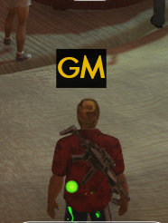

# GodMode
This SWL Addon provides a text indicator showing when the Auto-Loader bug has been triggered. 

 

The indicator can be customized in a number of ways:
- It can be moved in GUI edit mode (using the lock symbol at the top right of the screen).
- The text can be changed using `/setoption gm_text "XXXXX"` (default "GM") where `XXXXX` is the new text you want it to display
- The font size can be changed using `/setoption gm_fontsize XX` (default 30)
- The font color can be changed using `/setoption gm_color 0xYYYYYY` (default 0xFFCC00), where YYYYYY must be a six-digit hex code for the color you want. There are a variety of good <a href="https://www.w3schools.com/colors/colors_picker.asp">HTML color code websites</a> to choose from.

